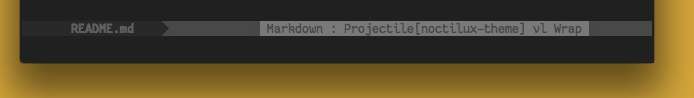

Noctilux
============

A fork of the Emacs 24+ theme [noctilux](https://github.com/stafu/noctilux-theme) with some color tweaks.

Differences from the original repo
------------------------------------

The `mode-line` color is more muted, with some info only visible when you hover over them. 

This is to make the theme more palatable for use with [powerline](https://github.com/milkypostman/powerline).

NOTE: Lots of rough edges. There isn't even an inactive mode-line color set yet.

Screenshots
============

Setup
-----

1. Add the directory containing `noctilux-definitions.el` and `noctilux-theme.el` to your `custom-theme-load-path` (e.g. `(add-to-list 'custom-theme-load-path "~/.emacs.d/lib/color-themes")`).
2. Add `(load-theme 'noctilux t)` somewhere to your Emacs initialisation.

Prerequisites
-------------

You'll at least need Emacs 24 for deftheme color-theme system. Used and tested with 24.3 and an sRGB graphical Emacs setup.

